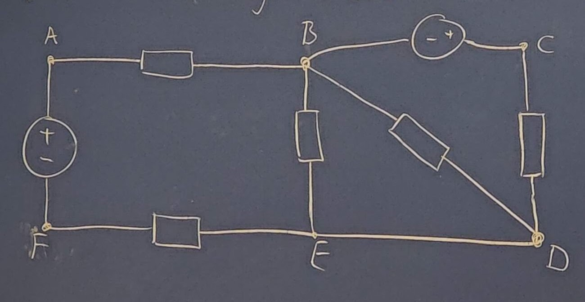

# 2022 11 08

## Repitition

- Seriekoppling
  - Ligger i samma strömbana och har därmed samma ström som går igenom dem (Inga förgeningar)
  - $R_S=R_1+R_2+R_3+...+R_n$
- Parallelkoppling
  - Kopplade till samma noder och har samma spänning som ligger över resistorerna
  - $R_p={1\over {{1\over R_1}+{1\over R_2}+{1\over R_3}+...+{1\over R_n}}}$
- Y/D-koppling
  - Y-koppling och D-koppling kan konverteras för att lättare kunna beräkna resistansen i kretsen
- Spänningsdelning
  - Samma exempelkres som vid seriekoppling
  - $u_1={R_1\over R_1+R_2+R_3}e$
  - $u_2={R_2\over R_1+R_2+R_3}e$
  - $u_3={R_3\over R_1+R_2+R_3}e$
- Strömdelning
  - Samma exempelkres som vid parallelkoppling
  - $i_1={{1\over R_1}\over {{1\over R_1}+{1\over R_2}+{1\over R_3}}}i$
  - $i_2={{1\over R_2}\over {{1\over R_1}+{1\over R_2}+{1\over R_3}}}i$
  - $i_3={{1\over R_3}\over {{1\over R_1}+{1\over R_2}+{1\over R_3}}}i$

## Nodanalys och maskanalys

- Nod
  - Punkt i nätet där 2 eller fler kretselement är förbundna med varandra
  - A - F är noder
- Gren
  - Del av krets som sammanbinder 2 noder
  - BAFE, BD, BE, DE är grenar
- Slinga
  - Sluten väg längs kretselement i en krets som inte passerar någon nod mer än en gång
  - S1-S5 är singor
- Maska
  - Slinga som inte innesluter någon gren
  - S1, S2,S3 och S4 är maskor
- Väsentlig nod

  - Punkt i nätet där 3 elle fler kretselement är förbundna
  - B, D, E är västliga noder
- Väsentlig gren
  - Gren som inte innehåller någon västentlig nod
  - AF,BC, AB

Vi behöver m oberoende ekvationer för att bestämma strömmarna i en krets med m väsentliga grenar.
Har kretesen n väsentliga noder kan vi formulera n-1 ekvationer med KCL.
Vi behöver fler ekvationer $m-(n-1)=m-n-1$ oberoende ekv saknas.
Två metoder för att formulera de ekvationer som behövs.

- Nodanalys
  - Bygger på KCL
- Maskanalys
  - Bygger på KVL

### Nodanalys

Steg för att genomföra nodanalys

1. Tilldela en nod potensialen noll = referensjord
2. Tilldela övriga noder godtyckliga potentialer
3. Teckna uttyck för strömmen i varje väsentlig gren
4. Används KCL för att sätta upp ekvationsystem med nodpotensialerna som obekanta
5. Grenströmmana fås ur nodpotensialerna

#### Nodanalys exempel 4.2

Utgår ifrån bilden nedan

Steg 3

$u_1=24-v$
$u_2=v$
$u_3=v-(-10)$

$i_1={24-v\over 100}$
$i_2={v\over 400}$
$i_3={v+10\over 200}$

Steg 4

KCL ger $i_1=i_2+i_3 => {24-v\over 100}={{v\over 400}+{v+10\over 200}}$

mult med 400 ger ${96-4v}={{v}+{2v+20}}$

ger $7v=76 => v\approx 10.86$

$i_2={10,86\over 400}\approx 27.1mA$
$i_3={10,86+10\over 200}\approx 104mA$
