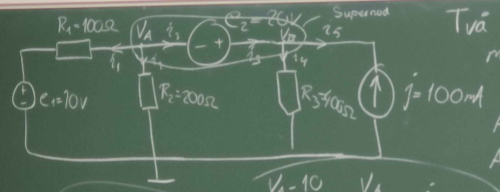
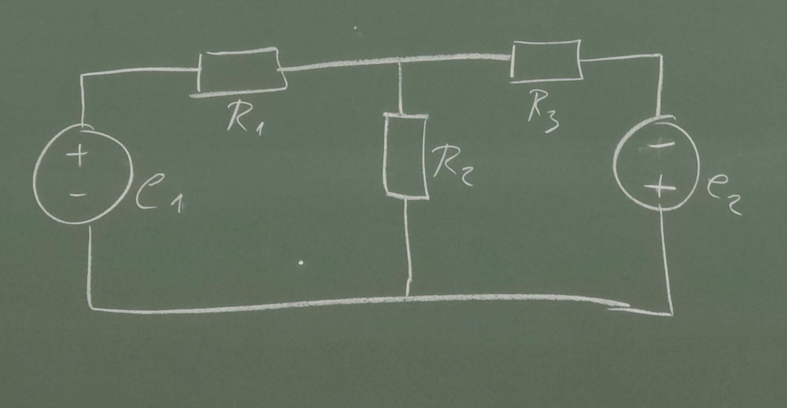
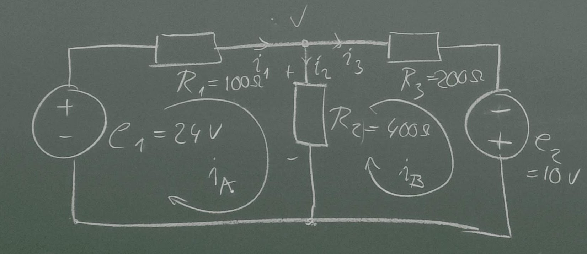
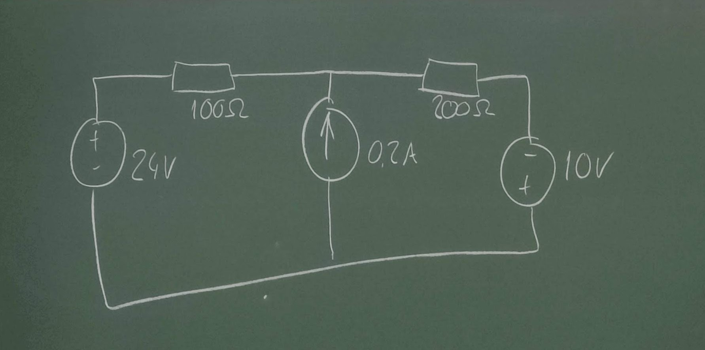
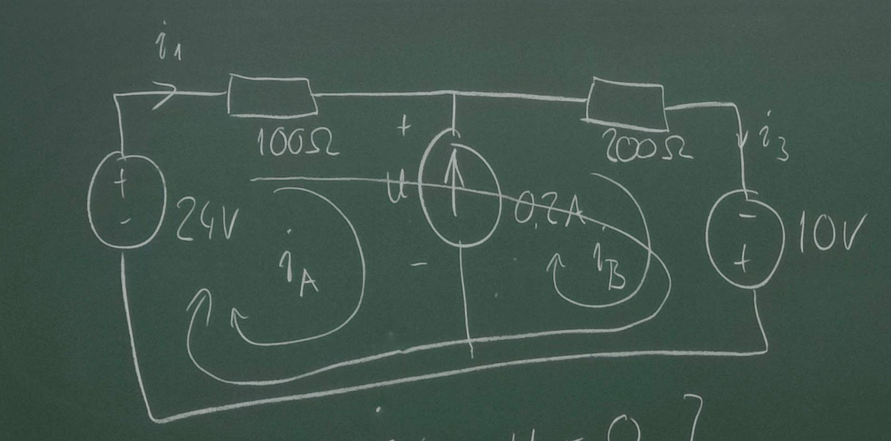

# 2022 11 09

## Nodanalys

1. Tilldela en väsentlig nod potensialen noll (referens jord)
2. Tilldela övriga väsentliga noder en godtycklig potential
3. Tecka strömmarna i varje väsentlig gren med nodpotentialen
4. Används KCL för att sätta upp ekvationsystem med nodpotensialerna som obekanta
5. Lös det resulterande ekvationssystemet

Två sätt att lösa problem med spänningskälla mellan två västentliga noder.

1. Se exempel 4.4
2. Se exempel 4.5

$V_B=V_A+20V$

${V_A-10\over 100}+{V_A\over 200}+i_3=0$

$-i_3+{V_B\over 400}-0,1=0$

Eliminera $i_3$

${V_A-10\over 100}+i_3+{V_A\over 200}-i_3+{V_B\over 400}-0,1=0$

${V_A-10\over 100}+{V_A\over 200}+{V_B\over 400}-0,1=0$

### Super nod

${i_3+i_1+i_2=0}$

${i_3=i_4+i_5}$

ger

${i_1+i_2+i_4+i_5=0}$

${V_A-10\over 100}+{V_A\over 200}+{V_B\over 400}-0,1=0$

## Maskanalys

Lösningssteg

1. Tilldela varje maska en cirkulerande ström (maskström)
2. Teckna strömmarna vi varje väsentlig gren med     maskströmmarna
3. KVL. Teckna i varje maksa en ekvation med KVL
4. Lös det resulterande ekvationssystemet
5. Bestäm grenströmmarna ur lösningen

Steg 2

$i_1=i_A$, $I_3=i_B$

$i_2=i_A-i_B$

Steg 3

KVL ger

- ${Maska A+24-100*i_A-400(i_A-i_B)=0=>-500i_A+400i_B=-24}$
- ${Maska B+400(i_A+i_B)-200i_B+10=0=>400i_A-600i_b=-10}$

Steg 4

$
 \begin{cases}
    (1)-500i_A+400i_B=-24\\(2)400i_A-600i_B=-10
 \end{cases}
$

Eliminering av $i_B$ ger

$6*(1)+4*(2)$ ger

${-3000i_A+2400i_B+1600i_A-2400i_B=144-40}$

${-1400i_A=-184=>i_A=131mA}$

(1)
${i_B={-24+500*0,131\over 400}=104mA}$

$i_1=i_A=131mA$

${i_3=i_B=104mA}$

${i_2=i_A-i_B=131-104=27mA}$

### Alternativ 1

Bestäm $i_1$ och $i_3$

$i_A=i_i$ och $i_3=i_B$

$i_B-i_A=0,2A$

$
 \begin{cases}
    (1)24-100i_A-u=0\\(2)u-200i_B+10=0
 \end{cases}
$

Adderar för att bli av med U

$24-100i_A-200i_B+10=0$

$24-100i_A-200(0,2+i_A)+10=0$

$34-40=300i_A=>I_A=-6/300=-20mA$

$i_B=0,2-0,02=0,18A$

$i_1=i_A=-20mA$

$i_3=i_B=180mA$

### Alternativ 2

Använd supermaska
$i_B-i_A=0,2$

$24-100i_A-200i_B+10=0$

Detta är en genväg eftersom den med hjälp av supermaskan "hoppar över" strömkällan och slipper därför skriva ett ekvations stystem.

&nbsp;

### Maskanalys fungerar bara i **plana nät**

dvs nät utan korsande ledningar
