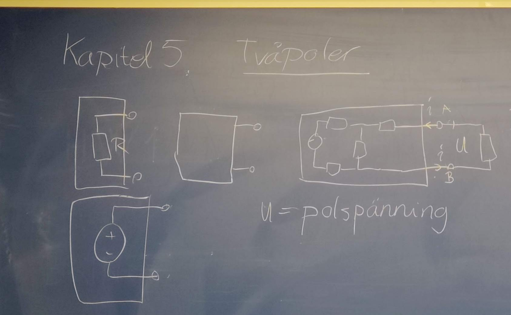
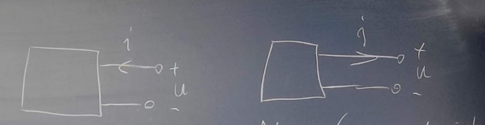
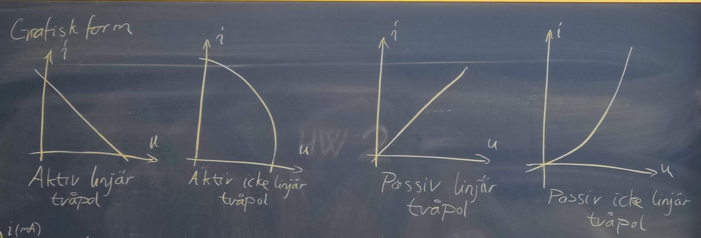
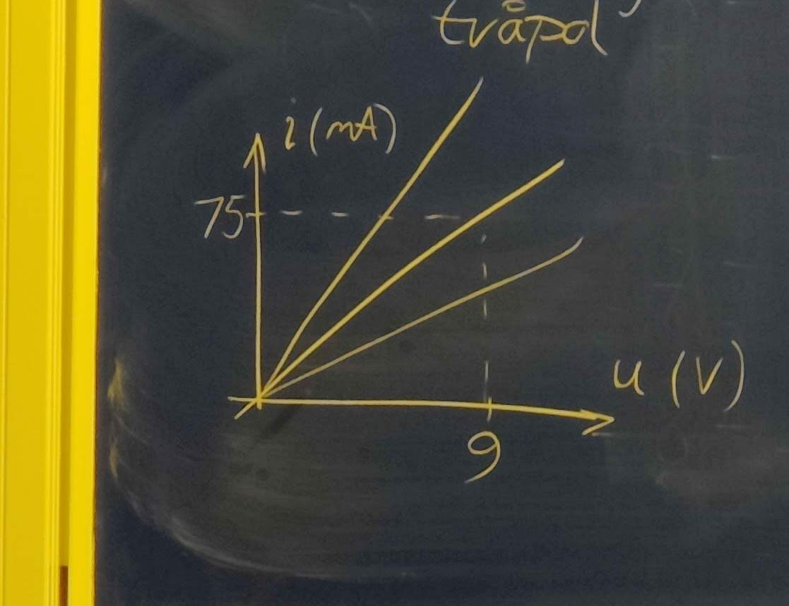
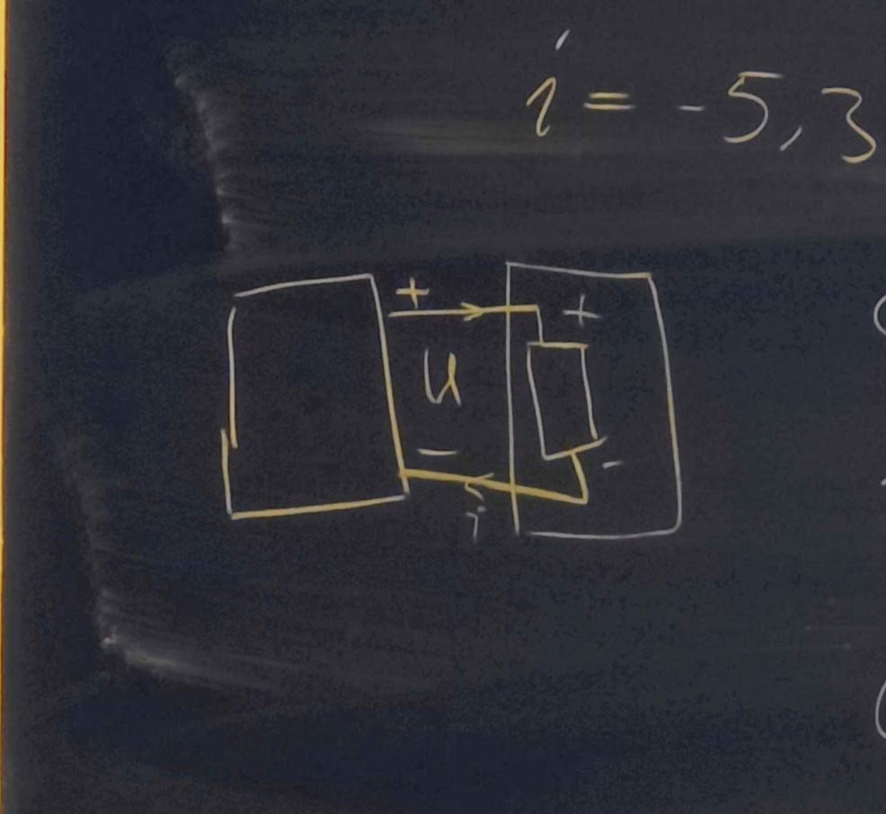
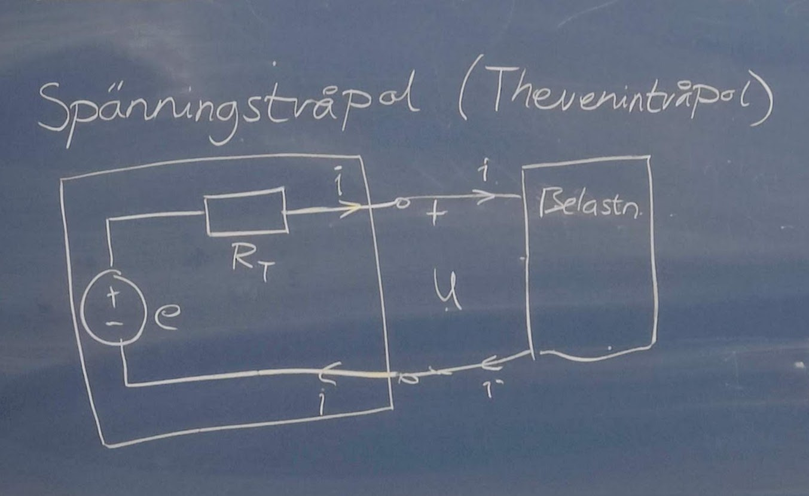
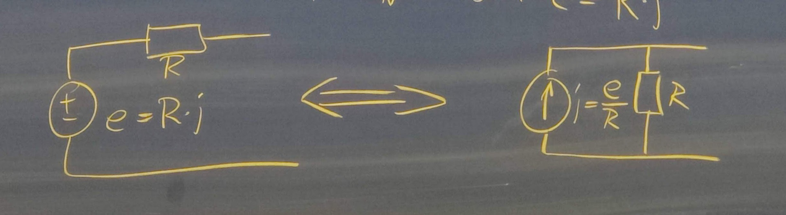
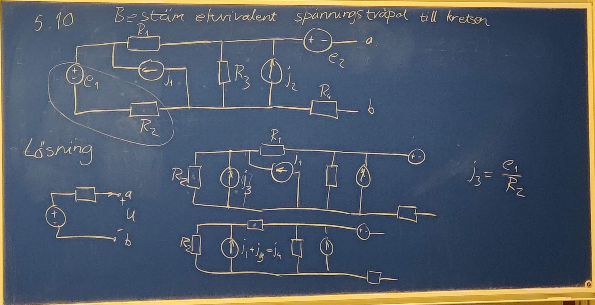
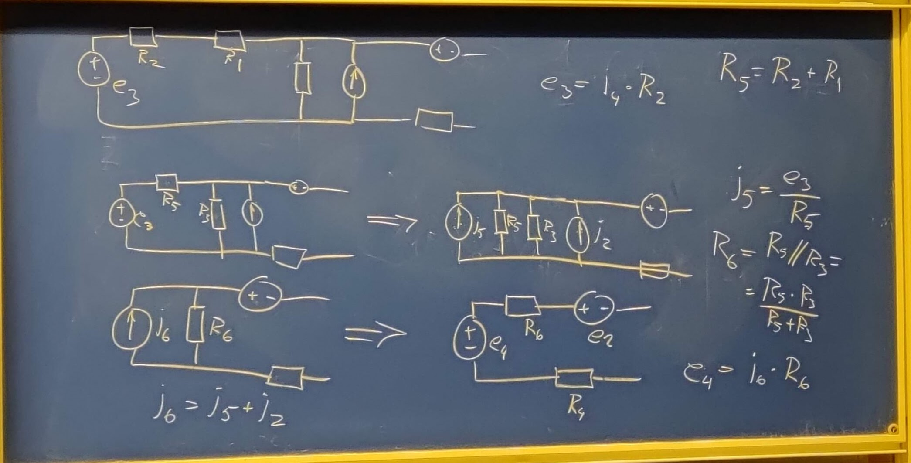
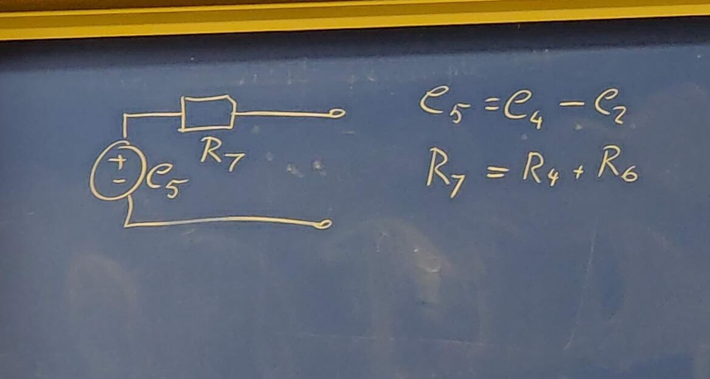

# 20221111

## Kapitel 5 tvåploer

Har två anslutningar, samma ström in och ut.
Spänningen mellan polerna kallas för polspänning.

Aktiva (eller generatoriska) referenser

- Batterier
- Generatorer
- Strömkällor
- Spänningskällor

Passiva (eller motoriska) referenser

- Resistorer
- Kondensatioer
- Spolar
- Lampor
- Motorer

### Tvåpolens karaktäristik

Ange genom sambandet mellan ström och spänning. Sambandet kan vara linjärt eller olinjärt

I verkligheten ofta olinjärt men vi kommer räkna mycket med linjära samband

### Grafisk form

**4 olika former:**

- Aktiv linjär tvåpol
- Aktiv ickelinjär tvåpol
- Passiv linjär tvåpol
- Passiv ickelinjär tvåpol

#### Exempel

Bestäm resistansen

Linjens luting $${{i\over u}={75*10^{-3}\over 9}}$$

Ger $${R={u\over i}={9\over 75*10^{-3}}}$$

$${i={u\over i}={5\over 120}}$$

### Resistor $$R=5,6*10^3Ω$$ ansluts till aktiv linjär tvåpol

$${i=-5,3*10^{-4}u+7,6*10^{-3}}$$

Bestäm resistorns ström och spänning

Ohm's lag ger
$${u=Ri=5,6*10^3i}$$

$${i=-5,3*10^{-4}*5,6*10^3i+7,6*10^3=>i=1,92mA}$$
$${u=5,6*10^3*19,2*10^{-3}=10,7V}$$

### Två enkla tvåpoler

#### Spänningstvåpol (Thevenintvåpol)

Batteri med polspänning $$u=4,2V$$ när $$i=0$$ och $$u=3,8V$$ när det avger $$0,5A$$ till en belastning

Bestäm spänningstvåpolen som modell för batteriet (e och $$R_T$)

KVL:

$${e-R_T*i-u=0}$$
$${i=0A}$$
$${u=4,2V=>e-R_T*0-4,2V=>e=4,2V}$$
$${i=0,5A}$$
$${u=3,8V=>4,2-R_T*0,5-4,2V=>R_T={4,2-3,8\over 0,5}=0,8Ω}$$

#### Strömtvåpol (Northontvåpol)

Bestäm en strömtvåpol för batteriet.

KVL:

$${R_N(j-i)-u=0=>i=-{u\over R_N}+j}$$
$${i=0A, u=4,2V}$$
$${0,5=-{4,2\over R_N}+j=>j={4,2\over R_N}}$$
$${i=0,5A, u=3,8V}$$
$${0,5={3,8\over R_N}+{4,2\over R_N}=>R_N={4,2-3,8\over 0,5}=0,8Ω}$$

$${j={4,2\over 0,8}=5,25A}$$

### Tvåpolsomvandling

Omvandling av spänningstvåpol till ekvivalent strömtvåpol och tvärtom. Tvåpolerna är lika i sin verkan innåt

KVL:
$${e-R_T*i-u=0}$$
$${u=e-R_T*i}$$

$${j-i={u\over R_N}}$$

KCL:

$${i=j-{u\over R_N}}$$
$${u=R_N*j-R_n*i}$$

Ekvivalenta om

$${R_T=R_N=R}$$

#### Exempel 5.10

Bestäm ekvivalent spänningstvåpol till kretsen

Lösning:

#### Specialfall

