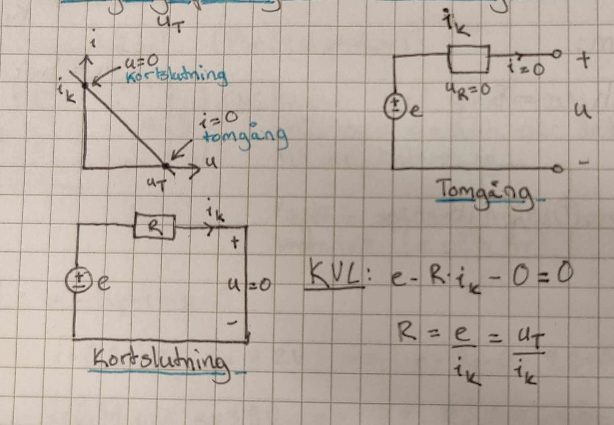
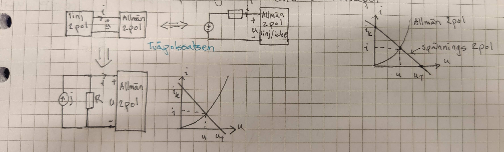
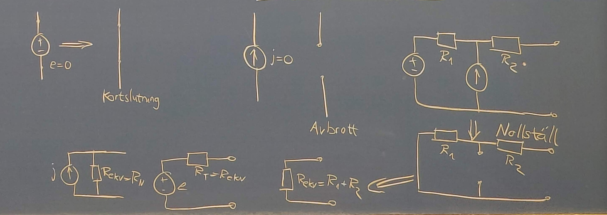
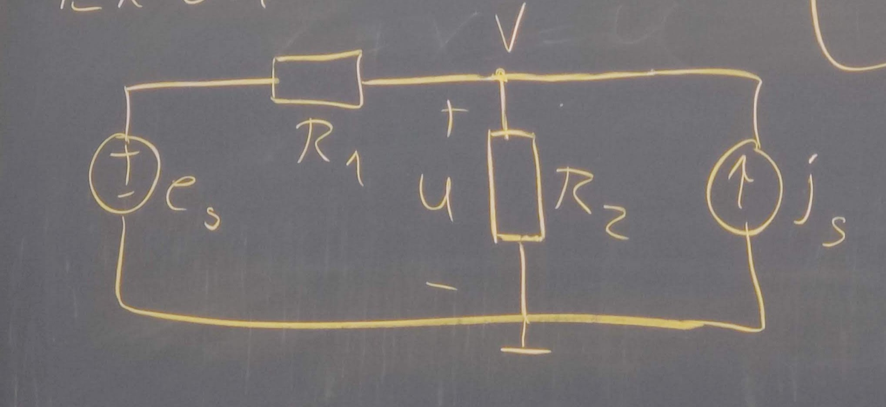

# 2022 11 15

## Två poler kap 5

- Aktiva (Passiva referenser)
- Passiva (Generatoriska retoriska)

### Ström och spänninghs karaktäristik

Förhållandet mellan ström och spänning

4 olika fall

- Aktiv linjär
- Aktiv ickelinjär
- Passiv linjär
- Passiv ickelinjär

### Spänningstvåpol (Thevenintvåpol)

Kan omvandlas till en strömtvåpol

### Strömtvåpol (Northontvåpol)

Kan omvandlas till en spänningstvåpol

### Tvåpolsomvandling

$$e=Rj$$
$$R_T=R_N=R$$
$$j={e\over R}$$

### Tomgångsspänning ($u_F$) och kortslutningsström ($i_k$)

Linjär aktiv tvåpol har två punkter där linjen skär x resepektive y axeln. När den korsar y-axeln har vi kortslutning. Värdet på y-axeln get kortslutningströmen. När linjen skär x-axeln så får vi ut tomgångsspänningen genom värdet på x-axeln

Vid tomgång är $u=e=u_T$

KVL på kretsen ger:
$$e+R*0-u_T=0$$
$$e=u_T$$

Vid kortslutning $u=0$

KVL på kretsen ger:
$$r-R*i_K-0=0$$
$$R={e\over i_K}={u_F\over i_K}$$

Spänningstvåpol ges av
$$e=u_T, R={u_T\over i_k}$$

## Kretsteorem kap 6

Kommer behandla

- Tvåpolssatsen
- Superpositionsprinsipen
- Effektanpassning

### Tvåpolssatsen

Förenklar beräkningar genom att omvandlar en del av kretsen till en tvåpol.

Används för **linjära** tvåpoler det vi säga linjära passiva komponenter och oberoende eller beroende energikällor

Polspänningen u och strömmen i kan beräknas genom att ersätta med dess ekvivalenta spänningstvåpol eller strömtvåpol

Tvåpolssatsen gör det möjligt att byta ut en linjärtvåpol mot en spänningstvåpol

Tvåpolssatsen gör det också möjligt att byta ut en linjärtvåpol mot en strömtvåpol

Sammanfattnihg av metoder för att omvandla linjär tvåpol till ekvivalent tvåpol

1. Allmän metod, bestäm $u_T$ och $i_K$ då gäller $e=u_T$ och $R={u_T\over i_K}$ eller $j=i_K$ och $R={u_T\over i_K}$
2. Om den linjära tvåpolen endast innehåller resistorer och oberoende källor kan den ekvivalenta tvåpolen bestämmas genom **succesiva tvåpolsomvandlingar,** eventuellt efter Y/D-omvandling

3. Resistansen kan ibland bestämmas separat. Om tvåpolen inte innehåller beroende källor kan resistansen R bestämmas som resistansen mellan A och B när alla **energikällor nollställs** (Spänningskällor blir som en kortslutning och strömkällor blir som ett avbrott).
Exempel 
4. Anslut en tänkt spänningskälla $u_0$ mellan punkterna a och b. Nollställ alla oberoende energikällor och beräkna strömmen $i_0$ in i tvåpolen som $u_0$ ger. Beräkna $R={u_0\over i_0}$

### Superpositionssatsen

Förenklar genom att man delar upp beräknigsarbetet i ett antal enklare monent.

I en linjär krets gäller att **spänningen över** eller **strömmen genom** en gren kan beräknas som summan av bidragen från varje **oberoende** energikälla för sig med de övriga energikällorna nollställda. OBS! **Beroende** källor får inte röras

### Exempel 6.4

Teckna u som funktion av $e_s$ och $i_s$. $u=v$ Nodanalys i punkten v
$${{u-e_s\over R_1}+{u\over R_2}-i_s=0}$$
$${u*{R_1+R_2\over R_1R_2}-i_s+{e_s\over R_1}=>u={R_1+R_2\over R_1R_2}i_s+{R\over R_1R_2}e_s}$$
Det vi säga linjärkombination av $e_s$ och $i_s$

#### Nollställ $e_s$ och beräkna strömbidrag

$R_1$ och $R_2$ är parallellkopplade
$${u={R_1+R_2\over R_1R_2}i_3}$$

#### Nollställ strömkällan och beräkna spänningskällas bidrag

.jpg)

$R_1$ och $R_2$ är seriekopplade ${R_4=R_1+R_2}$ Spänningsdelning ger
$${u_2={R_2\over R_1R_2}e_s}$$

$$u=u_1+u_2={R_1+R_2\over R_1R_2}i_3+{R_2\over R_1R_2}e_s$$
Ytterligare ett verktyg för att beräkna en förenklad krets.

### Effektanpassning

Hur stor effekt kan maximalt utvecklas i en resistor ansluten till en spänningstvåpol. Kommer se ut ungefär som grafen som sedan ger $R_b=R_T$ get $P_{b_{max}}$
$$P_{b_{max}}=u*i=e^2{R\over (R+R)^2}={e^2\over 4R}={e*{e\over R_{tot}}}$$
