# 2022 11 16

## Tenta 2021 08 18

Uppgift 2

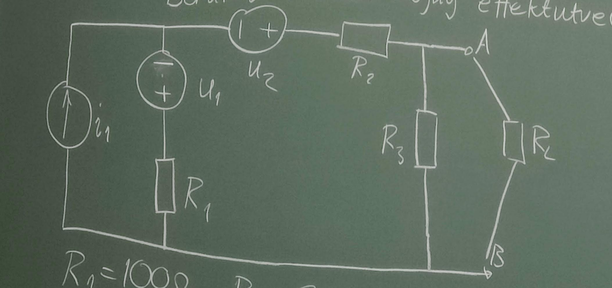

Anslut resistiv last $R_L$ mellan A och B. Beräkna maximalt möjlig effektutveckling i $R_L$

$$R_1=200Ω,R_2=200Ω,R_3=300Ω$$
$$i_1=400mA,u_1=20V,u_2=20V$$

Maxeffekt då $R_L=R$

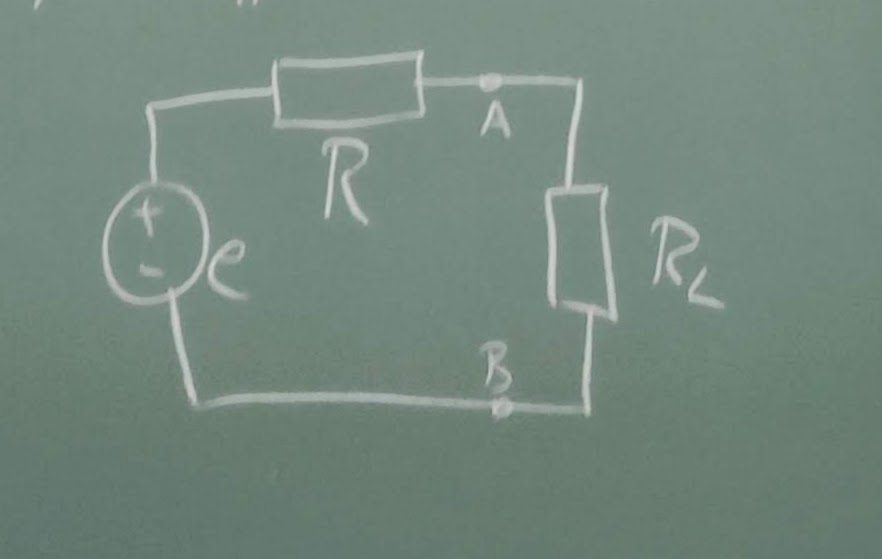

Succsesiv tvåpols omvandling

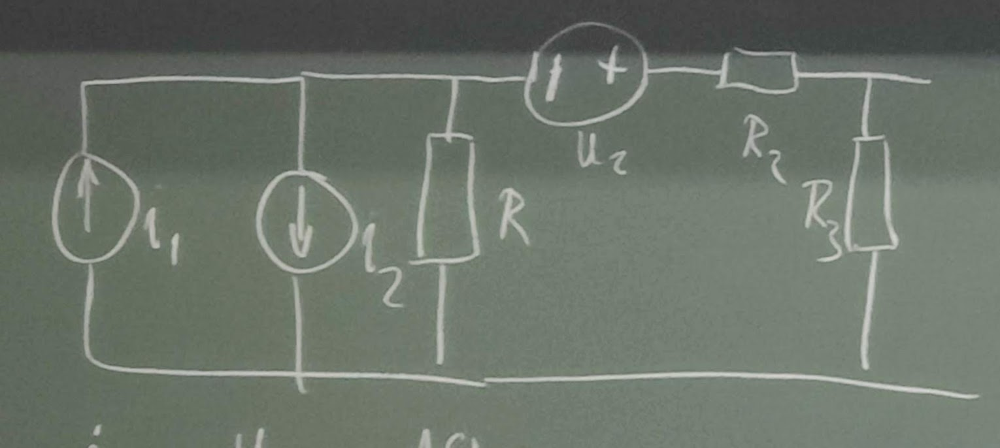

$$i_2={u_1\over R_1}={10\over 100}=0,1A$$

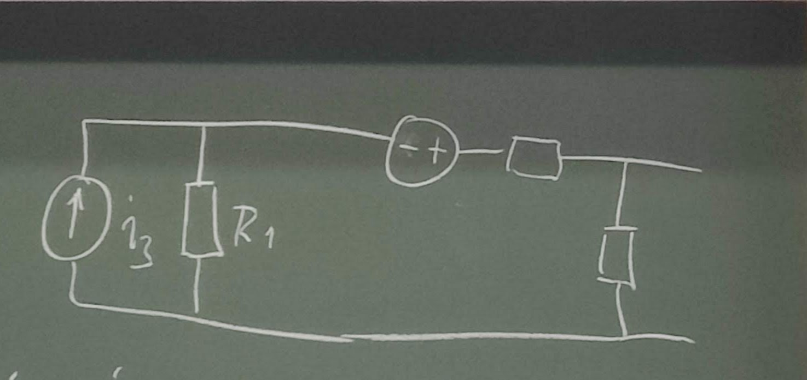

$$i_3=i_1-i_2=0,1-0,1=0$$

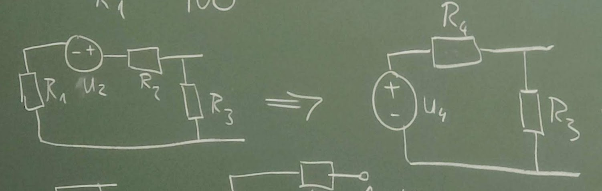

$$u_4=u_2$$
$$R_4=R_1+R_2=100+200=300Ω$$

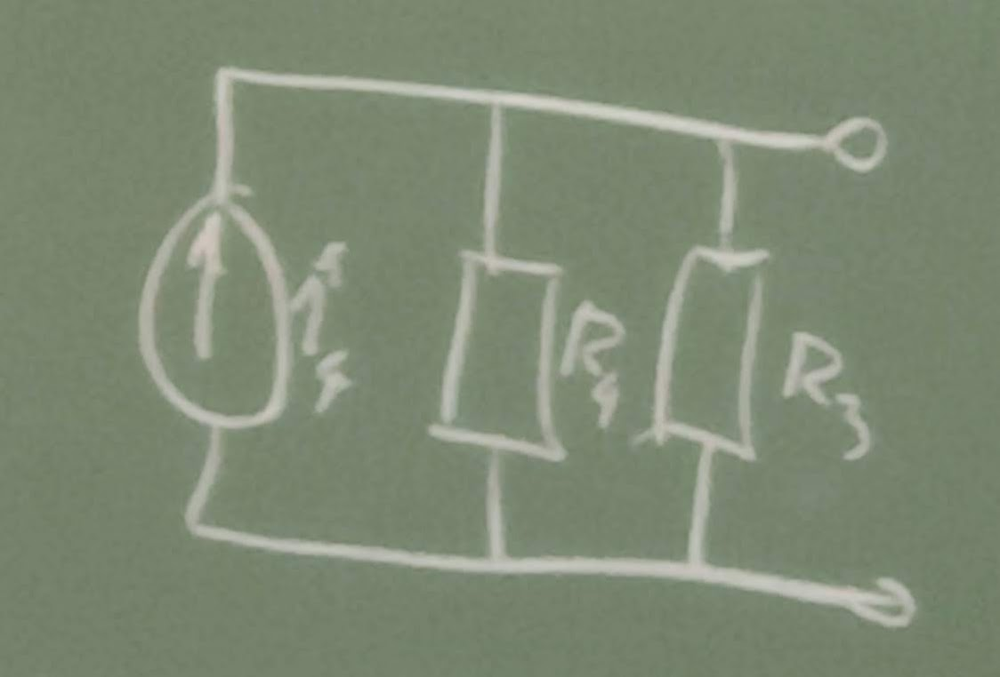

$$i_4={u_4\over R_4}={20\over 300}={1\over 15}A$$

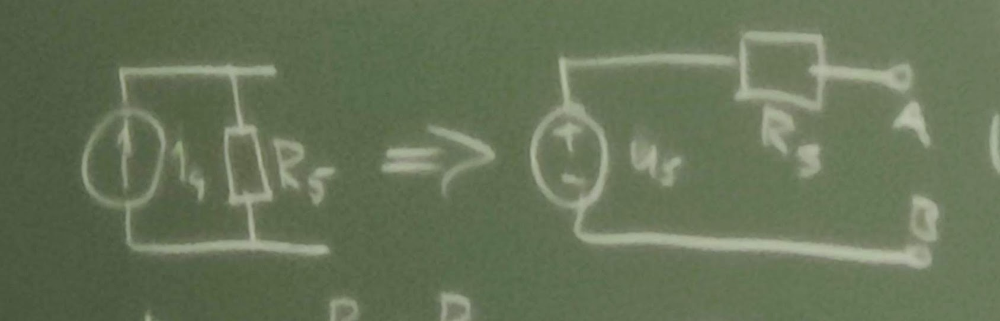

$$R_5={R_4R_3\over R_4+R_3}=150Ω$$
$$u_5=i*R_5=150*{1\over 15}=10V$$

Maxeffekt då $R_L=R=150Ω$

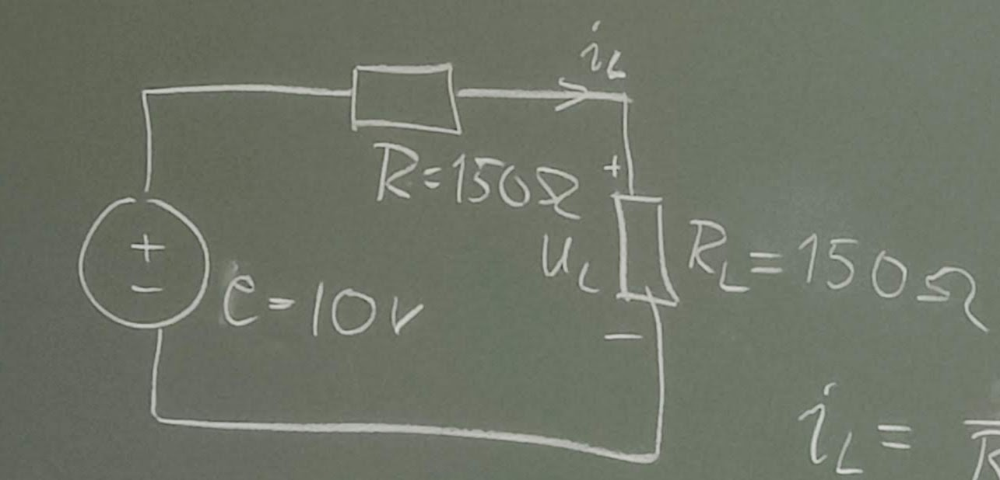

$$i_L={e\over R+R_L}={10\over 150+150}={10\over 300}$$
$$p_{lmax}=u_L*i_L=(i_L)^2*R_L=({10\over 300})^2*150=0,1667W$$

## Spolar och kondensatiorer

### Kondensator

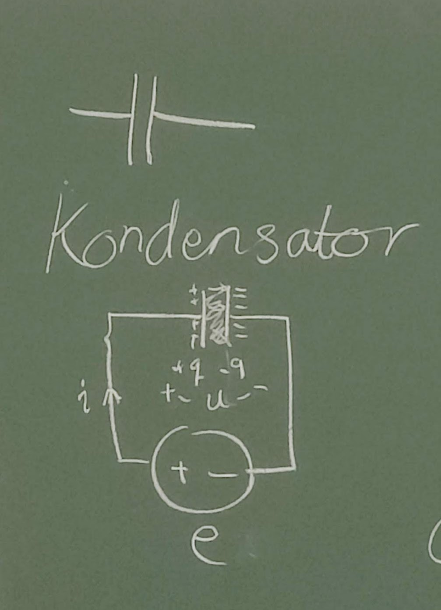

Komponent som kan **lagra energi** i **elektiska fält**

$$q=E*{A\over d}u$$
A = Area

d= Avstånd mellan plattor

$ε=ε_r*ε_0$

$ε_0$= permittiviteten för vakum (konstant)
$ε_r$= relativ permittivitet beror på material

Gäller för kvadratiska flattpr där A är mycket större än $d^2$ (get homogent fält)

$E*{A\over d}$ är konstant för varje material. Kallas kondensatorns kapasitans, beteknas C, enhet Farad [F]= $colomb\over Volt$

Varning! Blanda inte ihop capacitans och enheten C  

$$i(t)={dq\over dt}$$
$$q(t)=C*u(t)$$

ger

$$i(t)=C{du\over dt}$$

#### Seriekoppling kondensator

Vi vill förenkla till en ekvivalent kondensator

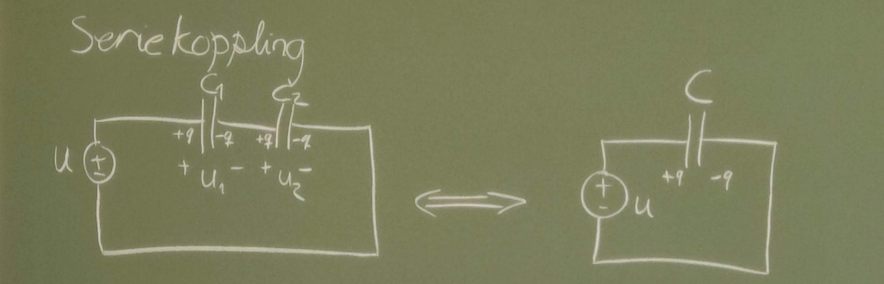

$$q=C_1*u_1=C_2*u_2$$
$$u_1={q\over C_1}, u_2={q\over C_2}$$

KVL:

$$u=u_1+u_2={q\over C_1}+{q\over C_2}=>{1\over C}={1\over C_1}+{1\over C_2}$$

#### Parallellkoppling kondensator

Vi vill förenkla till en ekvivalent kondensator

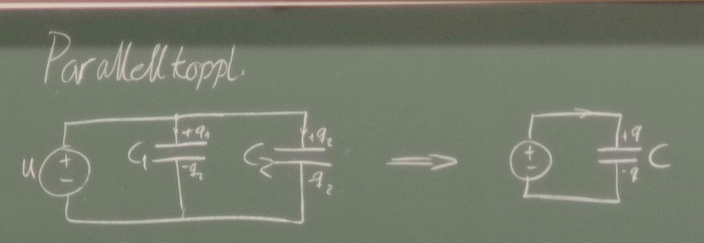

$$q=q_1+q_2=>Cu=C_1u+C_2u=>C=C_1+C_2$$
$$C=\sum_{k=1}^N C_k$$

### Spole

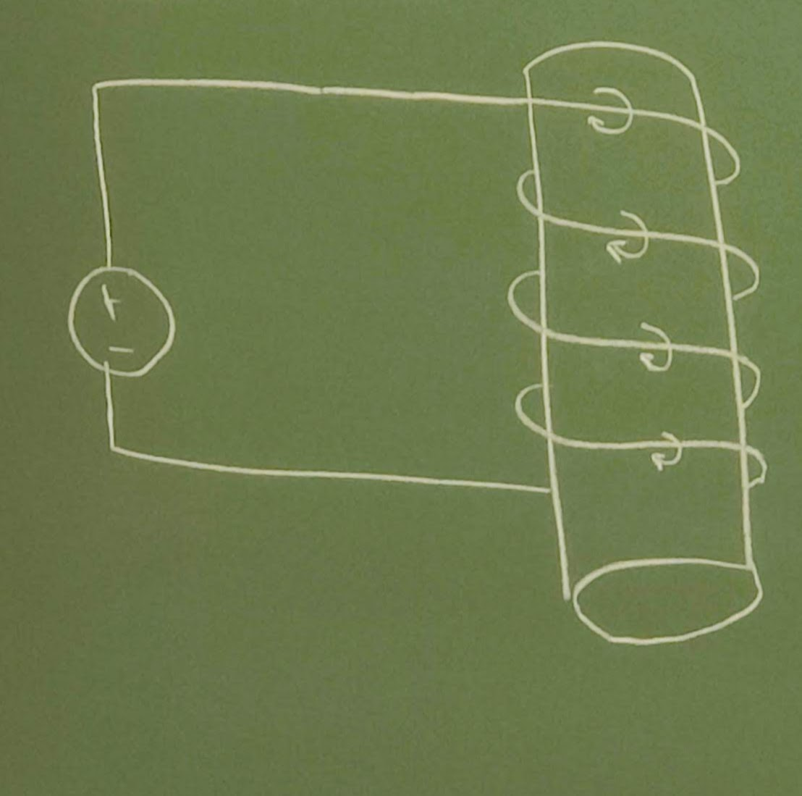

Komponent som lagrar **energi** i **magnetiskt fält**. Ledare som lindats ett antal varv runt en stomme/kärna. Varje ledningsvar omges av ett magnetfält som verkar till ett magnetiskt flöde e

#### Faraday's lag, induktionslagen

Variationer i magetfältet get spänning som motverkar variationerna i magetfältet (Lenz lag)

Faraday's lag, induktionslagen
$$u(t)=N{de\over dt}$$

$$e(t)=N*P*i(t)$$

P = spolens permeans, bestäms av spolens material och geometri (längd och diameter)

$$u(t)=N^2P{di\over dt}$$

Konstanten $N^2P$ kallas spolens induktans (L, enhet Henry [H])

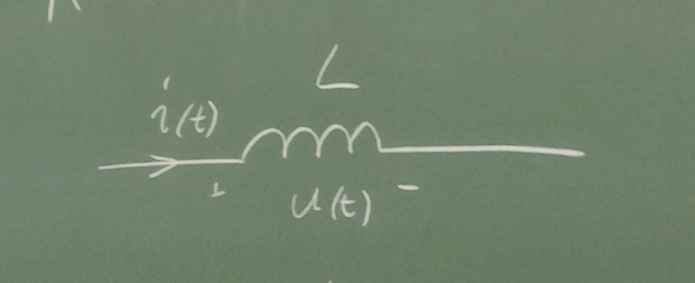

$$u(t)=L{di\over dt}$$

#### Seriekoppling spole

Vi vill ta oss till en krets där vi bara har en spole med induktansen L

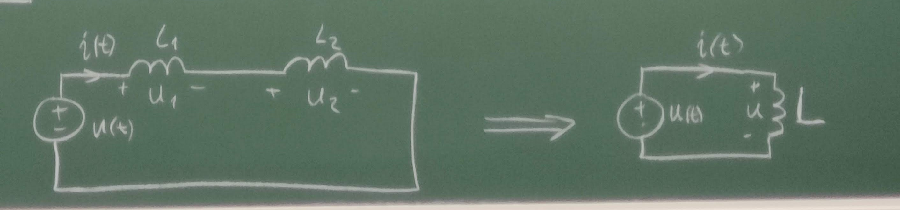

$$u_1(t)=L_1{di\over dt}, u_2=L_2{di\over dt}$$

KVL:

$$u(t)=u_1(t)+u_2(t)=L_1{di\over dt}+L_2{di\over dt}=(L_1+L_2){di\over dt}=L{di\over dt}$$
$$L=L_1+L_2$$
$$L=\sum_{k=1}^N L_k$$

#### Parallellkoppling spole

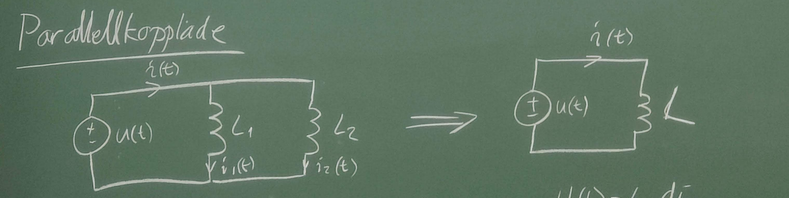

$$u(t)=L_1{di_1\over dt}, u(t)=L_2{di_2\over dt}, u(t)=L{di\over dt}$$
$${di_1\over dt}={u(t)\over L_1}, {di_2\over dt}={u(t)\over L_2},{di\over dt}={u(t)\over L}$$

KCL:

$$i(t)=i_1(t)+i_2(t)$$
$$u(t)=L{di\over dt}=L({di_1\over dt}+{di_2\over dt})=L({u(t)\over L_1}+{u(t)\over L_2})$$

$${i\over L}=\sum_{k=1}^N {i\over L_k}$$

#### Energi i spole

$$W_{spole}={1\over 2}L*i^2$$

#### Energi i kondensator

$$W_{kond}={1\over 2}Cu^2$$
