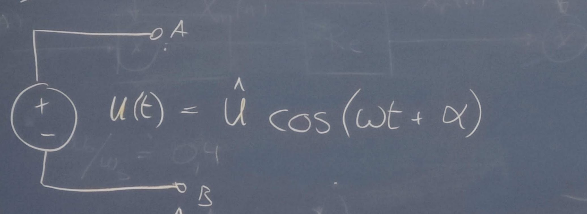
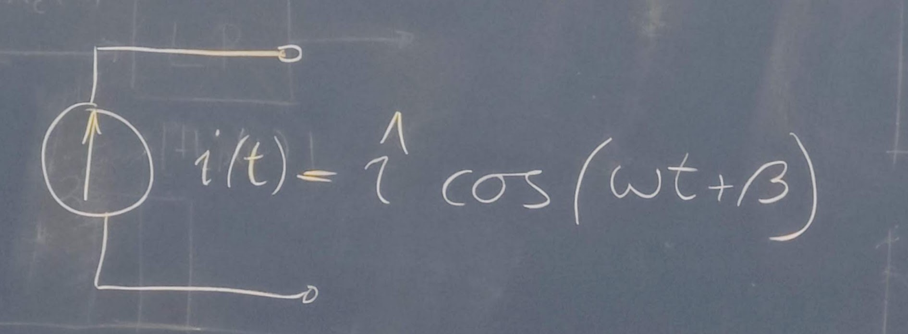
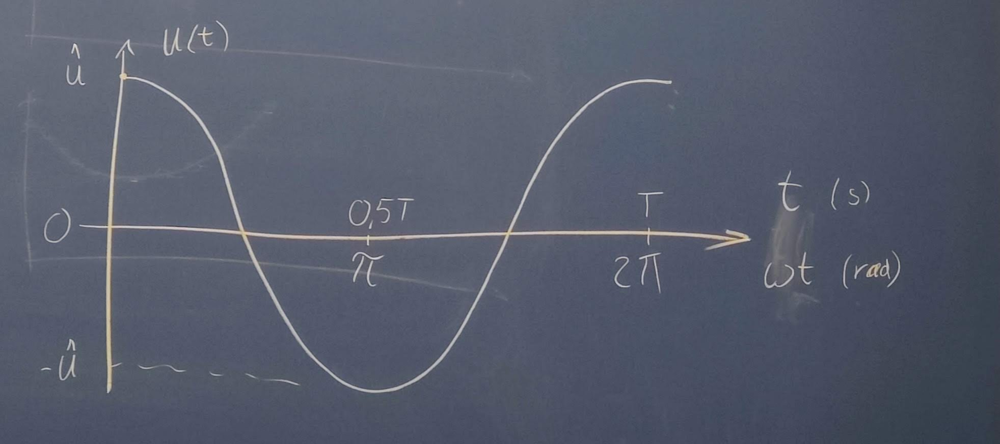
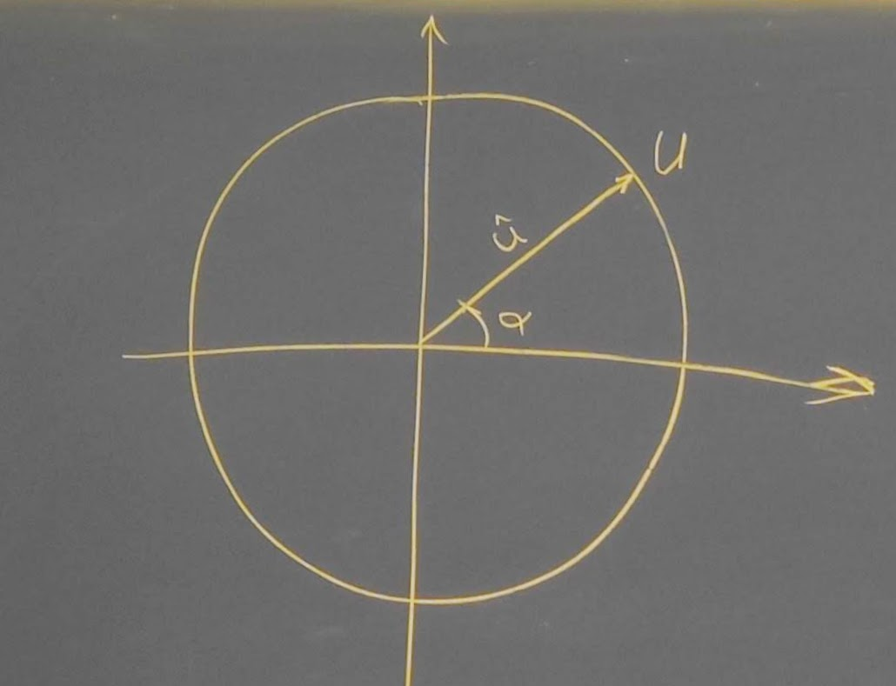
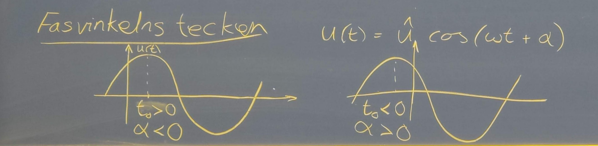
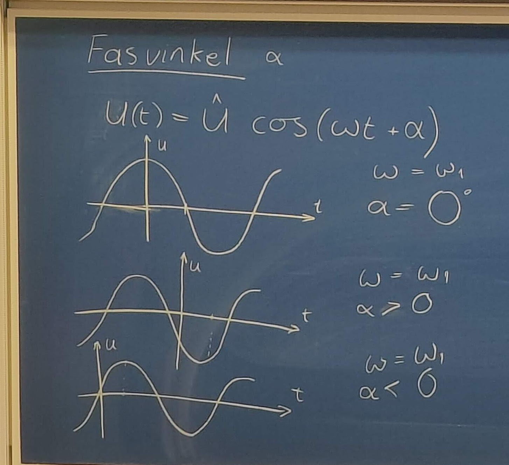
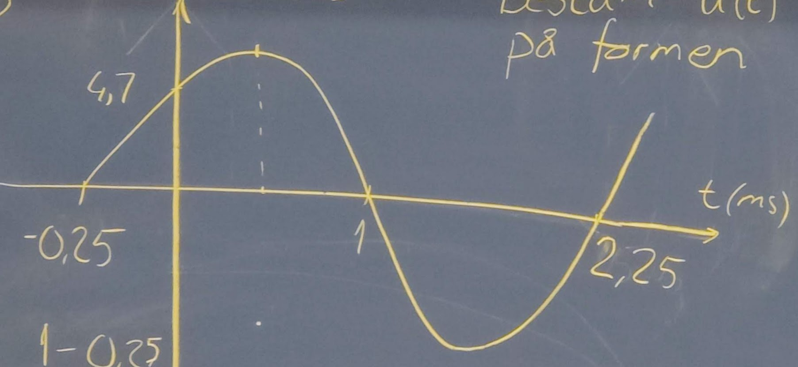
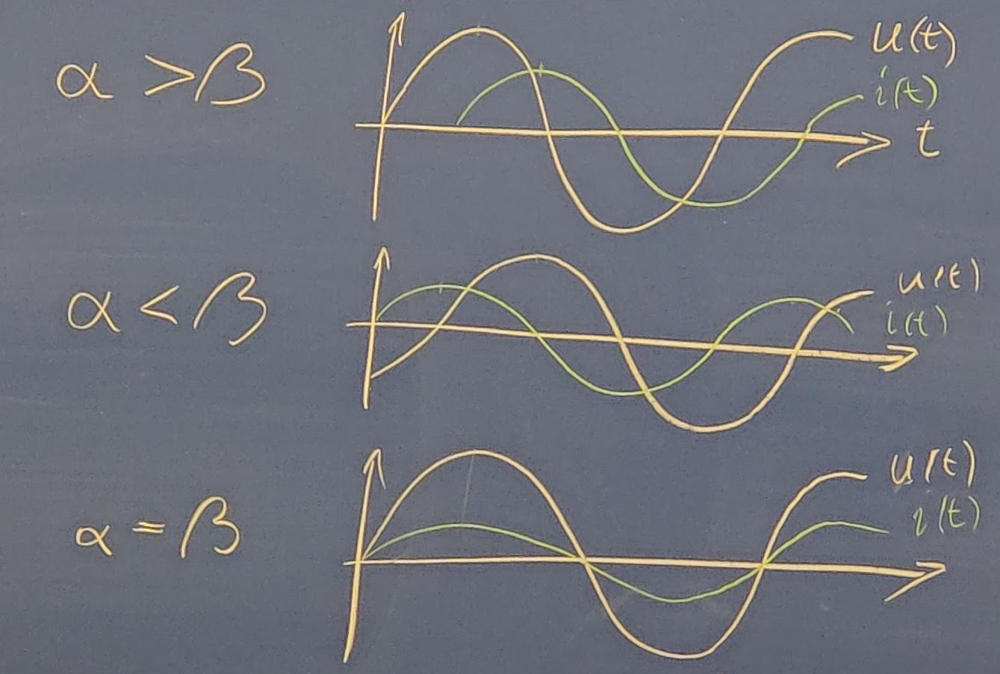
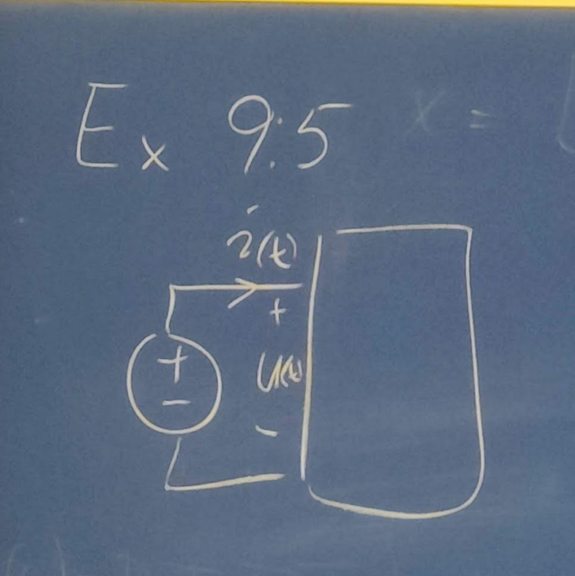

# 2022 11 18

## Repition

### Kondensator

Lagrar energi i elektiskt fält, mäts i Farad [F]  
C = Kapacitans

$$q(t)=C*u(t($$
$$i(t)={dq\over dt}=C{du\over dt}$$

Vid seriekoppling som paralellkoppling av resistorer  
Vid paralellkoppling som seriekoppling av resistorer

Energi: $W_c={1\over 2}Cu^2$

### Spole

Lagar energi i magnetiskt fält, mäts i Henry [H]
L = Induktans

$${u(t)=N{de\over dt}=L{di\over dt}}$$
e = magnetiskt flöde, Enhet Weber [Wb]
N = lindningsvarv

Vid seriekoppling samma som seriekoppling av resistorer  
Vid paralellkoppling sammma som paralellkoppling av resistorer  
Energi: $W_L={1\over 2}Li^2$

## Sinusformade växelstorheter Kap 9

Spänningskälla  
  
$$u(t)=ûcos(\omega t+\alpha)$$
Strömkälla  

$$i(t)=îcos(\omega t+\beta)$$
û och Î: amplitud (topvärde)  
$\omega$: är vinkelfrekvens [rad/s]  
$\alpha$ och $\beta$: fasvinkeln [grader eller rad]  
$\omega=2\pi f={2\pi\over T}$, $f={1\over T}$
f = frekvens [Hz]=[1/s]
T = periodtid [s]

$$sin(\omega t)=cos(\omega t-90\degree)$$
$$cos(\omega t)=sin(\omega t+90\degree)$$

  
  
$T=2\pi$

### Ex9.2

Bestäm u(t) vid $t=4,5*10^{-3}$ för spänningen $u(t)=5cos(180\pi t+56\degree)$

$$u=(4,5*10^{-3})=5cos(180\pi *4,5*10^{-}rad+56\degree)=$$
$$=5cos(2,54rad+56\degree)=$$
$$=5cos(145,8\degree+56\degree)=-4,64V$$

### Fasvinkelns tecken

  
$u(t)=ûcos(\omega t+\alpha)$  
Max då $\omega t+\alpha=0$ $cos(0\degree)=1$  
$u(t)=û*1=û=>\alpha=-\omega t$

### Fasvinkeln $\alpha$

  
$${u(t)=ûcos(\omega t+\alpha)}$$

#### Ex9.3

Bestäm u(t) i diagrammet nedan på formen ${u(t)=ûcos(\omega t+\alpha)}$  
  
$$T=2,25-(-0,25)=2,5ms$$
$${f={1\over T}={1\over 2,5*10^{-3}}=400Hz}$$  
$${\omega=2\pi f=2\pi*400=800\pi rad/s}$$
$$t={1-0,25\over 2}=0,375$$
$${{0,375*10^3\over T}360=54\degree=>\alpha=-54}$$

### Fasförskjutning

3 fall  

- $\alpha\gt\beta$
  - u(t) ligger före i(t)
  - i(t) ligger efter u(t)
- $\alpha\lt\beta$
  - u(t) ligger efter i(t)
  - i(t) ligger före u(t)
- $\alpha=\beta$
  - u(t) ligger i fas med i(t)
  - i(t) ligger i fas med u(t)

Anledningen till fasförskjutning:  
Kretsen innehåller spolar eller/och kondensatorer

### Växelströmseffekt

Momentan effekt  
$$p(t)=u(t)*i(t)={ûcos(\omega t+\alpha)*îcos(\omega t+\beta)}$$

Aktiv effekt P:  
Medelvärdet av den momentana effekten över en period  
$$P={û*î\over 2}*cos(\alpha-\beta)=$$
$$={{û\over \sqrt{2}}*{î\over \sqrt{2}}cos(\alpha-\beta)}$$
$u_e={{û\over \sqrt{2}}}:$ spänningens effektivvärde
$i_e={{î\over \sqrt{2}}}:$ strömmens effektivvärde
$e=\alpha-\beta:$ fasförskjutning mellan u och i
$cos(e):$ kretsens effektfaktor

#### Ex9.5

  
Bestäm medeleffekten som kretsens drar  
$$u(t)=325cos(314t+56\degree)V$$
$$i(t)=8,4cos(314t+12\degree)A$$
$$P=u_ei_ecos(e), u_e={325\over \sqrt{2}}, i_e={8,4\over \sqrt{2}}$$
$$P=229,8*5,94cos(44)=982W$$
